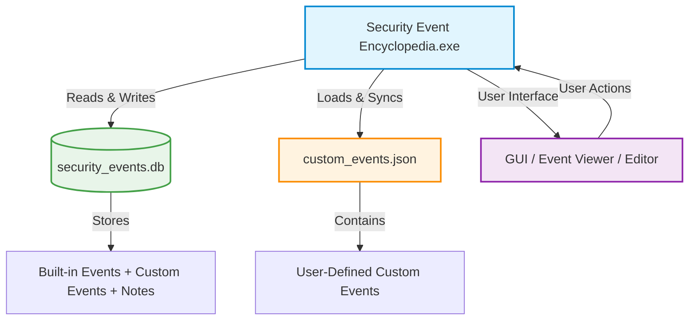

# 🧠 Security Event Encyclopedia

[](#)
[](#-security-highlights)
[](#)
[](LICENSE)

The **Security Event Encyclopedia** is a secure, desktop-based cybersecurity tool that centralizes event IDs, descriptions, and response guidance from multiple platforms.
It helps SOC analysts and security engineers investigate incidents faster with **MITRE mapping**, **encrypted notes**, **safe imports**, **validated URLs**, and **robust data protection**.

---

## 🚀 Key Features

* 🔎 **Centralized Event Knowledge Base** — Access details for Windows, Sysmon, SharePoint, SQL Server, Exchange, Linux, and Azure events.
* 🧩 **MITRE ATT&CK Mapping** — Each event includes corresponding Tactics and Techniques for quick reference.
* 🗝️ **Encrypted Analyst Notes** — Sensitive notes are stored securely to protect investigation data.
* 🌐 **Safe URL Validation** — Prompts user confirmation before opening any external link.
* 🧱 **Secure Import/Export** — Import events safely with file size checks; export to JSON or CSV.
* 🏷️ **IOC Tagging & Advanced Search** — Tag, filter, and search events efficiently.
* 🧾 **Custom Events Management** — Add, edit, and organize your own events with protection against modifying built-in ones.

---

## 🛡️ Security Highlights

| Category                  | Finding               | Risk Rating | Status                                     |
| ------------------------- | --------------------- | ----------- | ------------------------------------------ |
| Web Link & External Calls | Insecure URL Handling | Medium      | ✅ Mitigated with validation & confirmation |
| Database Security         | Unencrypted Database  | Medium      | ✅ Notes encryption implemented             |
| File Handling             | Large File Imports    | Low         | ✅ File size checks added                   |
| Input Validation          | Unrestricted Length   | Low         | ✅ Field length validation enforced         |
| Injection Risks           | SQL Injection         | Very Low    | ✅ Parameterized queries in use             |

---

## 💾 Installation

### 1. Download

Download the following three files from the repository’s **Releases** section:

* `Security Event Encyclopedia.exe`
* `custom_events.json`
* `security_events.db`

> ⚠️ **VirusTotal Notice**
> Some antivirus tools may flag the executable as potentially unsafe.
> This is a **false positive** caused by **PyInstaller**, which packages Python scripts into executables.
>
> Verify it yourself here:
> 🔗 [VirusTotal Report](https://www.virustotal.com/gui/file/5e28c1625220a8524eb20c910cfa59d015065cca51c171f32e7088dd7636b8d1/detection)
>
> The source code and Python script are open and safe to inspect.

### 2. Run the Application

Place all three files in the **same directory** and double-click:

```
Security Event Encyclopedia.exe
```

No installation is required — it runs as a portable application.

---

## 🧩 How the Files Work

### 🧱 `Security Event Encyclopedia.exe`

This is the **main application executable**, built from the Python source using **Tkinter** for the GUI and **PyInstaller** for packaging.
It serves as the graphical interface that allows users to:

* View and search security events by ID, category, platform, or severity.
* Add, edit, or delete **custom events**.
* Record and encrypt analyst notes.
* Import and export event databases in JSON or CSV format.
* Open validated external reference links (with confirmation prompt).

---

### 📘 `custom_events.json`

A **JSON file** that stores user-defined events added through the application.
Each entry includes details such as event ID, title, description, severity, MITRE ATT&CK mapping, and response guidance.

**Example structure:**

```json
{
  "event_id": "25001",
  "event_title": "Operation Copy - Copy item to another Exchange mailbox folder",
  "description": "Copies a mailbox item within the mailbox...",
  "severity": "Low",
  "category": "Mailbox Operations",
  "platform": "Exchange",
  "response_guidance": "Validate the action aligns with user activity...",
  "reference_links": [
    "https://learn.microsoft.com/microsoft-365/compliance/search-the-audit-log-in-security-and-compliance"
  ],
  "mitre_tactic": "Collection",
  "mitre_technique": "T1114 - Email Collection",
  "tags": "Mailbox Operations"
}
```

**Purpose:**

* Retains all **custom and user-enriched events** added through the GUI.
* Synchronizes automatically with `security_events.db` when the app starts or exits.
* Makes user-created data portable between systems.

---

### 🗄️ `security_events.db`

A **SQLite database** used by the application to store all security event data — both built-in and user-defined.

**Contains the following tables:**

* `security_events` → Stores event metadata (IDs, titles, severities, categories, platforms, MITRE mappings, tags, etc.).
* `user_notes` → Stores analyst comments or findings linked to specific events.

**Key Functions:**

* Enables instant searching and filtering across multiple parameters.
* Prevents duplication of event entries.
* Supports automatic saving and updating of edited data.
* Ensures persistent and structured data storage for analysts.

---

## 🧠 How They Work Together

| Component                         | Description        | Function                                      |
| --------------------------------- | ------------------ | --------------------------------------------- |
| `Security Event Encyclopedia.exe` | Main program (GUI) | Loads, manages, and visualizes event data     |
| `security_events.db`              | SQLite Database    | Stores all event data and analyst notes       |
| `custom_events.json`              | JSON File          | Keeps user-created events for reimport/export |

**Workflow Summary:**

1. When the application launches, it loads all built-in events into the database.
2. It then reads `custom_events.json` to add any user-defined events.
3. Any changes (additions, edits, or deletions) are written back to both the database and JSON file.

---

## 🧩 Technical Architecture



**Explanation:**

* The **.exe** serves as the controller and interface.
* **security_events.db** acts as the structured backend database.
* **custom_events.json** keeps user-created events portable between sessions.
* All three interact seamlessly to maintain data persistence and security integrity.

---

## 🧭 Usage Guide

1. **Search Events:** Use keywords or event IDs in the search bar.
2. **Filter Results:** Apply filters by platform, severity, MITRE tactic, or technique.
3. **View Details:** Click any event to view detailed description, guidance, and references.
4. **Add New Event:** Use “Add New Event” to define your custom entries.
5. **Add Secure Notes:** Document analyst observations tied to events.
6. **Export Data:** Export all events to JSON or CSV for backup or sharing.

---

## 📊 Supported Platforms

* Windows Security Logs
* Sysmon
* SharePoint
* SQL Server
* Exchange
* Linux Syslog
* Azure / Cloud Events

---

## 👨‍💻 Developer

Developed by **Rushab** — built for cybersecurity professionals, SOC analysts, and incident responders seeking a secure, all-in-one event reference companion.

---

## 📄 License

This project is licensed under the **MIT License** — see the [LICENSE](LICENSE) file for details.

---

## 📷 Application Screenshots


---
