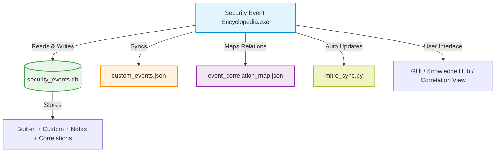

# 🧠 Security Event Encyclopedia

[](#)
[](#-security-highlights)
[](#)
[](LICENSE)

The **Security Event Encyclopedia** is a secure, desktop-based cybersecurity intelligence tool that centralizes event IDs, response guidance, and MITRE mappings from multiple platforms.
It empowers **SOC Analysts, Threat Hunters, and Security Engineers** to investigate incidents faster through intelligent event correlation, real-time MITRE syncing, and collaborative knowledge management.

---

## 🚀 Key Features

* 🔎 **Centralized Event Knowledge Base** — Unified access to Windows, Sysmon, SharePoint, SQL Server, Exchange, Linux, and Azure event IDs.
* 🧩 **MITRE ATT&CK Mapping** — Each event automatically linked with tactics and techniques for rapid triage.
* ⚙️ **Auto MITRE Sync (New)** — Automatically updates the encyclopedia with the latest MITRE ATT&CK data through `mitre_sync.py`.
* 🔗 **Correlation With Common Event IDs (New)** — Dynamically map related events across platforms using the built-in correlation engine (`event_correlation_map.json`).
* 🧠 **Knowledge Management & Collaboration (New)** — Share notes, mark key insights as “Reference,” and access a centralized **Shared Knowledge Hub** for team learning.
* 🗝️ **Encrypted Analyst Notes** — Securely store and retrieve investigation data with protected access.
* 🌐 **Safe URL Validation** — Every link requires user confirmation before opening in a browser.
* 🧱 **Secure Import/Export** — Safely import or export events with validation and file-size checks.
* 🏷️ **IOC Tagging & Advanced Search** — Tag, filter, and cross-search by keywords, MITRE Tactics, Techniques, or Severity.
* 🧾 **Custom Events Management** — Add, edit, and organize your own events while preserving the built-in library.

---

## 🛡️ Security Highlights

| Category                  | Finding                   | Risk Rating | Status                                  |
| ------------------------- | ------------------------- | ----------- | --------------------------------------- |
| Web Link & External Calls | Insecure URL Handling     | Medium      | ✅ Validated with confirmation prompt    |
| Database Security         | Unencrypted Database      | Medium      | ✅ Encrypted notes storage implemented   |
| File Handling             | Large File Imports        | Low         | ✅ File-size check added                 |
| Input Validation          | Unrestricted Field Length | Low         | ✅ Field length validation enforced      |
| Injection Risks           | SQL Injection Possibility | Very Low    | ✅ Parameterized queries used throughout |

---

## 💾 Installation

### 1. Download

Download the following **four** files from the repository’s **Releases** section:

* `Security Event Encyclopedia.exe`
* `custom_events.json`
* `security_events.db`
* `event_correlation_map.json` *(new placeholder for correlation feature)*

> ⚠️ **VirusTotal Notice**
> Some antivirus tools may falsely flag the executable due to **PyInstaller** packaging.
> Verify independently here:
> 🔗 [VirusTotal Report](https://www.virustotal.com/gui/file/5e28c1625220a8524eb20c910cfa59d015065cca51c171f32e7088dd7636b8d1/detection)

### 2. Run the Application

Place all files in the **same directory**, then run:

```
Security Event Encyclopedia.exe
```

No installation required — portable, ready-to-use.

---

## 🧩 How the Files Work

### 🧱 `Security Event Encyclopedia.exe`

The main application executable (Tkinter GUI + PyInstaller) that lets you:

* View, search, and filter events.
* Add / edit custom events.
* Add encrypted analyst notes.
* Sync MITRE data automatically.
* Correlate related events visually.
* Import / export secure JSON data.

---

### 📘 `custom_events.json`

Stores all **user-defined** events added via the GUI.

**Purpose**

* Retains and syncs user-enriched data.
* Automatically updates with the SQLite database.

---

### 🔗 `event_correlation_map.json` — *(New Feature)*

A lightweight JSON mapping file used by the correlation engine.

**Functionality**

* Tracks relationships between events (e.g., Windows 4625 ↔ Sysmon 3).
* Automatically created if missing.
* Managed entirely through the GUI.

---

### 🗄️ `security_events.db`

SQLite database for all built-in and custom events.

**Contains**

* `security_events` — core event metadata
* `user_notes` — analyst collaboration hub
* `event_correlations` — linked relationships (New)

---

## 🧠 Feature Details

### 🔗 1.3  Correlation With Common Event IDs

Automatically link related events across platforms.
SOC analysts can discover chains of activity (e.g., a failed Windows logon followed by a Sysmon process spawn).
Managed through the “Related Events” panel and saved to `event_correlation_map.json`.

---

### 🧠 4  Knowledge Management & Collaboration

Collaborate securely through in-app notes and the **Shared Knowledge Hub**.
Analysts can:

* Add contextual notes with name and severity.
* Pin important findings as “Reference Notes.”
* Filter by analyst or keyword.
* View top referenced events for cross-training and incident review.

---

### ⚙️ 5.2  Auto MITRE Sync

Leverages the `mitre_sync.py` module to pull the latest MITRE ATT&CK Tactics & Techniques and update the database automatically.

**Highlights**

* Accessible via `Tools → Auto MITRE Sync`.
* Progress bar and status messages display real-time sync updates.
* Ensures all events stay aligned with the latest MITRE framework.

---

## 🧩 Technical Architecture



---

## 🧭 Usage Guide

1. **Search Events:** Enter keywords or event IDs.
2. **Filter Results:** Filter by platform, severity, or MITRE technique.
3. **View Correlations:** Open “Related Events” to see cross-platform links.
4. **Add Notes:** Document findings and pin critical observations.
5. **Auto MITRE Sync:** Keep the encyclopedia updated with one click.
6. **Export Data:** Save all records to JSON or CSV for reporting.

---

## 📊 Supported Platforms

* Windows Security Logs
* Sysmon
* SharePoint
* SQL Server
* Exchange
* Linux Syslog
* Azure / Cloud Events

---

## 👨‍💻 Developer

Developed by **Rushab U.** — for SOC Analysts and Cybersecurity Professionals seeking a secure, modern, and collaborative event analysis framework.

---

## 📄 License

This project is licensed under the **MIT License** — see the [LICENSE](LICENSE) file for details.

---

## 📷 Application Screenshots


